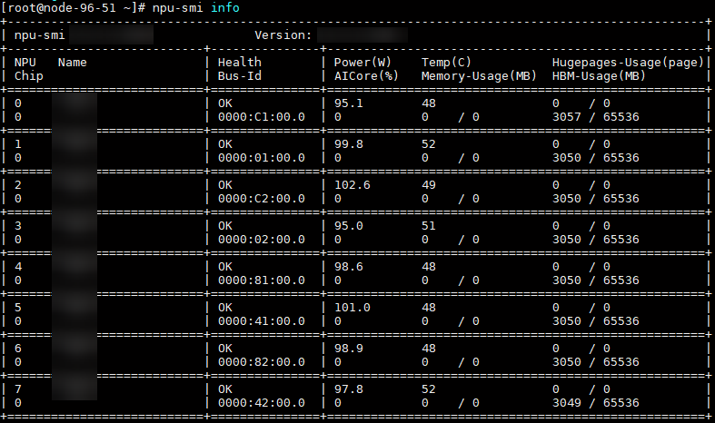

# 快速入门

## 环境准备

本文档以 Atlas 800I A2 推理服务器和 Qwen2-7B 模型为例，让开发者快速开始使用 MindIE 进行大模型推理流程。

### 前提条件

物理机部署场景，需要在物理机安装 NPU 驱动固件以及部署 Docker，执行如下步骤判断是否已安装 NPU 驱动固件和部署 Docker。

- 执行以下命令查看 NPU 驱动固件是否安装。若出现类似如[图 1](#figure1)所示，说明已安装。否则请参见[表 1](#table1)进行安装。

    ```bash
    npu-smi info
    ```

    **图 1**  回显信息  <a id="figure1"></a>

    

    **表 1** Atlas A2 推理系列产品 <a id="table1"></a>

    | 产品型号      | 参考文档                                                                                                                                                                                                                                                                                                                                                                                                                                                                                  |
    | ------------- | ----------------------------------------------------------------------------------------------------------------------------------------------------------------------------------------------------------------------------------------------------------------------------------------------------------------------------------------------------------------------------------------------------------------------------------------------------------------------------------------- |
    | Atlas 800I A2 | 下载[固件与驱动](https://hiascend.com/hardware/firmware-drivers/community)，安装请参考《CANN 软件安装》中的"[安装 NPU 驱动和固件](https://www.hiascend.com/document/detail/zh/canncommercial/850/softwareinst/instg/instg_0005.html?Mode=PmIns&InstallType=local&OS=openEuler)"章节（商用版）或"[安装 NPU 驱动和固件](https://www.hiascend.com/document/detail/zh/CANNCommunityEdition/850/softwareinst/instg/instg_0005.html?Mode=PmIns&InstallType=local&OS=openEuler)"章节（社区版）。 |

- 执行以下命令查看 Docker 是否已安装并启动。Docker 的安装可参见[安装 Docker](../install/source/docker_installation.md)。

    ```bash
    docker ps
    ```

    回显以下信息表示 Docker 已安装并启动。

    ```text
    CONTAINER ID        IMAGE        COMMAND         CREATED        STATUS         PORTS           NAMES
    ```

### 获取模型权重

1. 请先下载权重，这里以 Qwen2-7B 为例，下载链接：[https://huggingface.co/Qwen/Qwen2-7B/tree/main](https://huggingface.co/Qwen/Qwen2-7B/tree/main)，将权重文件上传至服务器任意目录（如 `/home/weight`）。
2. 执行以下命令，修改权重文件权限：

    ```bash
    chmod -R 755 /home/weight
    ```

### 获取容器镜像

进入[昇腾官方镜像仓库](https://www.hiascend.com/developer/ascendhub/detail/af85b724a7e5469ebd7ea13c3439d48f)，根据设备型号选择下载对应的 MindIE 镜像。

该镜像已具备模型运行所需的基础环境，包括：CANN、FrameworkPTAdapter、MindIE 与 ATB Models，可实现模型快速上手推理。

**表 2**  容器内各组件安装路径

| 组件          | 安装路径                     |
| ------------- | ---------------------------- |
| CANN          | /usr/local/Ascend/cann       |
| CANN-NNAL-ATB | /usr/local/Ascend/nnal/atb   |
| MindIE        | /usr/local/Ascend/mindie     |
| ATB Models    | /usr/local/Ascend/atb-models |

> [!NOTE] 说明
>
> - 部分版本的镜像，MindIE-LLM 组件会以 whl 包的形式安装，其路径可以通过 `pip show mindie_llm` 进行查看，最新发布的版本和更早期的版本使用 run 包方式安装，其主要差异为安装的路径和服务化拉起方式。
> - whl 包安装方式下，MindIE-LLM 安装路径为 `{site_packages}/mindie_llm/`，ATB Models 安装路径为 `/usr/local/Ascend/atb_llm`。
> - run 包安装方式下，MindIE-LLM 安装路径为 `/usr/local/Ascend/mindie/latest/mindie-llm/`，ATB Models 安装路径为 `/usr/local/Ascend/atb-models`。

## 启动容器

1. 下载完成镜像后，执行以下命令启动容器。

    ```bash
    docker run -it -d --net=host --shm-size=500g \
           --name <container-name> \
           -w /home \
           --device=/dev/davinci0:rwm \
           --device=/dev/davinci1:rwm \
           --device=/dev/davinci2:rwm \
           --device=/dev/davinci3:rwm \
           --device=/dev/davinci_manager:rwm \
           --device=/dev/hisi_hdc:rwm \
           --device=/dev/devmm_svm:rwm \
           -v /usr/local/Ascend/driver:/usr/local/Ascend/driver:ro \
           -v /usr/local/dcmi:/usr/local/dcmi:ro \
           -v /usr/local/bin/npu-smi:/usr/local/bin/npu-smi:ro \
           -v /usr/local/sbin/:/usr/local/sbin:ro \
           -v /home/weight:/home/weight:ro \
           {IMAGE_ID} bash
    ```

    > [!NOTE] 说明
    > - `{IMAGE_ID}` 为镜像 ID，镜像安装完成后，执行 `docker images` 命令，即可查看对应 ID，替换在上述命令中即可。
    > - 对于 `--device` 参数，挂载权限设置为 `rwm`，而非权限较小的 `rw` 或 `r`，原因如下：
    > - 对于 Atlas 800I A2 推理服务器，若设置挂载权限为 `rw`，可以正常进入容器，同时也可以使用 `npu-smi` 命令查看 npu 占用信息，并正常运行 MindIE 业务；但如果挂载的 npu（即对应挂载选项中的 `davinci_xxx_`，如 `npu0` 对应 `davinci0`）上有其它任务占用，则使用 `npu-smi` 命令会打印报错，且无法运行 MindIE 任务（此时 `torch.npu.set_device()` 会失败）。
    > - 对于 Atlas 800I A3 超节点服务器，若设置挂载权限为 `rw`，进入容器后，使用 `npu-smi` 命令会打印报错，且无法运行 MindIE 任务（此时 `torch.npu.set_device()` 会失败）。

    **表 1**  参数说明

    | 参数                                                    | 参数说明                                                                                                                                                                                                                                                                                                                                                                                                                              |
    | ------------------------------------------------------- | ------------------------------------------------------------------------------------------------------------------------------------------------------------------------------------------------------------------------------------------------------------------------------------------------------------------------------------------------------------------------------------------------------------------------------------- |
    | -it                                                     | 表示启动一个交互式终端（`-i`）并将其连接到容器的标准输入输出（`-t`），能够与容器内部进行交互，如运行命令行操作。                                                                                                                                                                                                                                                                                                                      |
    | -d                                                      | 表示容器将以后台模式运行，即容器在后台启动。使用该参数后不会阻塞当前终端的操作，可以在启动容器后继续进行其他操作。                                                                                                                                                                                                                                                                                                                    |
    | --net                                                   | 表示容器将使用宿主机的网络配置（网络共享），使容器能够直接访问宿主机的网络接口，适用于需要进行低延迟、直接访问网络资源的场景。                                                                                                                                                                                                                                                                                                        |
    | --shm-size                                              | 表示指定容器的共享内存（`/dev/shm`）大小，用户可自行设置，`1g` 为示例值。对于多模态理解模型，若业务最大并发数较高，`--shm-size` 建议设置不小于 `100g`。<br>该值不能超过宿主机剩余的物理内存总量，可使用 `free -h` 命令查看。当开启数据并行（即 DP > 1 时），需要随 DP 增大调整共享内存大小：<br>当 DP=2 时，shm-size 至少为 2g<br>当 DP=4 时，shm-size 至少为 3g<br>当 DP=8 时，shm-size 至少为 5g<br>当 DP=16 时，shm-size 至少为 9g |
    | --name                                                  | 表示给容器指定一个名称。`<container-name>` 是容器的标识符，可以自行设置，且在当前系统中具有唯一性。如果不设置，Docker 会自动分配一个随机名称。                                                                                                                                                                                                                                                                                        |
    | --device                                                | 表示映射的设备，可以挂载一个或者多个设备。<br>需要挂载的设备如下：<ul><li>`/dev/davinci*X*`：NPU 设备，X 是 ID 号，如：`davinci0`。</li><li>`/dev/davinci_manager`：davinci 相关的管理设备。</li><li>`/dev/hisi_hdc`：hdc 相关管理设备。</li><li>`/dev/devmm_svm`：内存管理相关设备。</li></ul>可根据 `ll /dev/ \| grep davinci` 命令查询 device 个数及名称，根据需要绑定设备，修改上面命令中的 `--device=****`。                     |
    | -v /usr/local/Ascend/driver:/usr/local/Ascend/driver:ro | 将宿主机目录 `/usr/local/Ascend/driver` 挂载到容器，请根据驱动所在实际路径修改。                                                                                                                                                                                                                                                                                                                                                      |
    | -v /usr/local/sbin:/usr/local/sbin:ro                   | 将宿主机工具 `/usr/local/sbin/` 以只读模式挂载到容器中，请根据实际情况修改。                                                                                                                                                                                                                                                                                                                                                          |
    | -v /home/weight:/home/weight:ro                         | 设定权重挂载的路径，需要根据用户的情况修改。请将权重文件和数据集文件同时放置于该路径下。                                                                                                                                                                                                                                                                                                                                              |

2. 执行以下命令进入容器。

    ```bash
    docker exec -it <container-name> /bin/bash
    ```

## 模型推理

1. 若安装路径为默认路径，执行如下命令，进入 MindIE 安装目录。

    ```bash
    cd /usr/local/Ascend/mindie/latest
    ```

2. 设置环境变量。<a id="setup_env"></a>

    运行以下命令初始化各组件环境变量，并开启日志打印。

    ```bash
    # 配置CANN环境，默认安装在/usr/local目录下
    source /usr/local/Ascend/ascend-toolkit/set_env.sh
    # 配置加速库环境
    source /usr/local/Ascend/nnal/atb/set_env.sh
    # 配置模型仓环境变量
    source /usr/local/Ascend/atb-models/set_env.sh
    # MindIE
    source /usr/local/Ascend/mindie/latest/mindie-llm/set_env.sh
    source /usr/local/Ascend/mindie/latest/mindie-service/set_env.sh
    # 开启MindIE日志打印
    export MINDIE_LOG_TO_STDOUT="true"
    ```

3. 配置服务化参数。

    a. 进入 `conf` 目录，打开 `config.json` 文件。

    ```bash
    cd mindie-service/conf
    vim config.json
    ```

    b. 按 `i` 进入编辑模式，根据实际情况修改 `config.json` 中的配置参数。（以下已 Qwen2-7B 为例，需要修改的配置参数已加粗）

    ``` json

    {
        "ServerConfig" :
            {
            "httpsEnabled" : false
            },
        "BackendConfig" :
         {
                "npuDeviceIds" : [[0,1,2,3]],
                "ModelDeployConfig" :
            {
                    "ModelConfig" : [
                    {
                        "modelName" : "qwen2-7b",
                        "modelWeightPath" : "/home/weight",
                        "worldSize" : 4,
                        "trustRemoteCode": false
                    }
                ]
            },
        }
    }
    ```

    如上的参数说明如下，更多 `config.json` 的参数说明请参考[配置参数说明（服务化）](../user_manual/service_parameter_configuration.md)。

    | 配置项          | 取值类型                      | 取值范围                                                                                                               | 配置说明                                                                                                                                                                                                                                                                                                                                                                                                                                                                                                                 |
    | --------------- | ----------------------------- | ---------------------------------------------------------------------------------------------------------------------- | ------------------------------------------------------------------------------------------------------------------------------------------------------------------------------------------------------------------------------------------------------------------------------------------------------------------------------------------------------------------------------------------------------------------------------------------------------------------------------------------------------------------------ |
    | httpsEnabled    | bool                          | true（开启）false（关闭）                                                                                              | 是否开启 HTTPS 通信安全认证。`true`：开启 HTTPS 通信。`false`：关闭 HTTPS 通信。如果网络环境不安全，不开启 HTTPS 通信，即 `httpsEnabled` = `false` 时，会存在较高的网络安全风险。                                                                                                                                                                                                                                                                                                                                        |
    | npuDeviceIds    | std::vector<std::set<size_t>> | 根据模型和环境的实际情况来决定。                                                                                       | 表示启用哪几张卡。对于每个模型实例分配的 `npuIds`，使用芯片逻辑 ID 表示。在未配置 `ASCEND_RT_VISIBLE_DEVICES` 环境变量时，每张卡对应的逻辑 ID 可使用 `npu-smi info -m` 指令进行查询。若配置 `ASCEND_RT_VISIBLE_DEVICES` 环境变量时，可见芯片的逻辑 ID 按照 `ASCEND_RT_VISIBLE_DEVICES` 中配置的顺序从 0 开始计数。例如：`ASCEND_RT_VISIBLE_DEVICES=1,2,3,4` 则以上可见芯片的逻辑 ID 按顺序依次为 0,1,2,3。多机推理场景下该值无效，每个节点上使用的 `npuDeviceIds` 根据 `ranktable` 计算获得。必填，默认值：[[0,1,2,3]]。 |
    | modelName       | string                        | 由大写字母、小写字母、数字、中划线、点和下划线组成，且不以中划线、点和下划线作为开头和结尾，字符串长度小于或等于 256。 | 模型名称。必填，默认值：`llama_65b`。                                                                                                                                                                                                                                                                                                                                                                                                                                                                                    |
    | modelWeightPath | std::string                   | 文件绝对路径长度的上限与操作系统的设置（Linux 为 `PATH_MAX`）有关，最小值为 1。                                        | 模型权重路径。程序会读取该路径下的 `config.json` 中 `torch_dtype` 和 `vocab_size` 字段的值，需保证路径和相关字段存在。必填，默认值：`/data/atb_testdata/weights/llama1-65b-safetensors`。该路径会进行安全校验，需要和执行用户的属组和权限保持一致。                                                                                                                                                                                                                                                                      |
    | worldSize       | uint32_t                      | 根据模型实际情况来决定。每一套模型参数中 `worldSize` 必须与使用的 NPU 数量相等。                                       | 启用几张卡推理。必填，默认值：4。                                                                                                                                                                                                                                                                                                                                                                                                                                                                                        |
    | trustRemoteCode | bool                          | truefalse                                                                                                              | 是否信任远程代码。`false`：不信任远程代码。`true`：信任远程代码。选填，默认值：`false`。如果设置为 `true`，会存在信任远程代码行为，可能会导致恶意代码注入风险，请自行保障代码注入安全风险。                                                                                                                                                                                                                                                                                                                              |

    c. 按 `Esc`，输入`:wq!`，按 `Enter` 保存并退出编辑。

    d. 设置 `config.json` 文件权限为 `640`。

    ```bash
    chmod 640 config.json
    ```

4. 启动服务。

    a. 执行如下命令，进入安装目录。

    ```bash
    cd /usr/local/Ascend/mindie/latest/mindie-service
    ```

    b. 两种启动服务方法如下所示。

    - 方式一（推荐）：使用后台进程方式启动服务。后台进程方式启动服务后，关闭窗口时进程也会保留。

        ```bash
        nohup ./bin/mindieservice_daemon > output.log 2>&1 &
        ```

        在标准输出流捕获到的文件中，打印如下信息说明启动成功。

        ```text
        Daemon start success!
        ```

    - 方式二：直接启动服务。

        ```bash
        ./bin/mindieservice_daemon
        ```

        回显如下则说明启动成功。

        ```text
        Daemon start success!
        ```

    > [!CAUTION]注意
    > - `bin` 目录按照安全要求，目录权限为 `550`，没有写权限，但执行推理过程中，算子会在当前目录生成 `kernel_meta` 文件夹，需要写权限，因此不能直接在 `bin` 启动 `mindieservice_daemon`。
    > - Ascend-cann-toolkit 工具会在执行服务启动的目录下生成 `kernel_meta_temp_xxxx` 目录，该目录为算子的 cce 文件保存目录。因此需要在当前用户拥有写权限目录下（例如 `Ascend-mindie-server_{version}_linux-{arch}` 目录，或者用户在 `Ascend-mindie-server_{version}_linux-{arch}` 目录下自行创建临时目录）启动推理服务。
    > - 如需切换用户，请在切换用户后执行 `rm -f /dev/shm/*` 命令，删除由之前用户运行创建的共享文件。避免切换用户后，该用户没有之前用户创建的共享文件的读写权限，造成推理失败。
    > - 标准输出流捕获到的文件 `output.log` 支持用户自定义文件和路径。
    >
    > [!NOTE]说明
    > - 如果使用的是部分 whl 包安装 MindIE-LLM 的镜像，则在 MindIE-LLM 安装路径以外的任意位置执行 `mindie-llm-server` 命令即可拉起服务。

5. 发送请求。

    服务化 API 接口请参考《MindIE LLM 开发指南》中的[RESTFUL API 参考](https://www.hiascend.com/document/detail/zh/mindie/300/mindiellm/llmdev/mindie_service0065.html)章节。

    用户可使用 HTTPS 客户端（Linux `curl` 命令，Postman 工具等）发送 HTTPS 请求，此处以 Linux `curl` 命令为例进行说明。

    重开一个窗口，使用以下命令发送请求。例如验证服务是否拉起：

    ```bash
    curl -H "Accept: application/json" -H "Content-type: application/json" -X POST -d '{
    "prompt": "My name is Olivier and I ",
    "max_tokens":10
    }' http://127.0.0.1:1025/generate
    ```

    回显如下则表明请求发送成功：

    ```text
    {"text":["My name is Olivier and I  25 years old. I am a French student"]}
    ```

## 精度测试

> [!NOTE] 说明
>
> - 精度测试和性能测试前，请先重开一个窗口进入容器，并参见[设置环境变量](#setup_env)。
> - 以下精度测试以 AISBench 工具为例，AISBench 工具的详细使用方法请参见[AISBench 工具](https://gitee.com/aisbench/benchmark)。

1. 安装 AISBench 工具。

    ```bash
    git clone https://gitee.com/aisbench/benchmark.git
    cd benchmark/
    pip3 install -e ./ --use-pep517
    pip3 install -r requirements/api.txt
    pip3 install -r requirements/extra.txt
    ```

    > [!NOTE] 说明
    >
    > - MindIE 镜像已经集成 AISBench 测试工具，无需上述安装步骤即可使用，可以通过 `pip show ais_bench_benchmark` 查看安装路径，下文使用镜像集成版代指此版本，git 安装版代指上述 `git clone` 方式安装的版本。
    > - 下文使用 `{ais_bench_path}` 表示 AISBench 安装路径。镜像集成版一般在 `{site-packages}/ais_bench`，git 安装版在 clone 后代码仓根目录下的 `ais_bench` 子目录。

2. 准备数据集。

    以 `gsm8k` 为例，单击[gsm8k 数据集](https://opencompass.oss-cn-shanghai.aliyuncs.com/datasets/data/gsm8k.zip)下载数据集，将解压后的 `gsm8k` 文件夹复制到 `{ais_bench_path}/datasets`。

3. 配置 `{ais_bench_path}/benchmark/configs/models/vllm_api/vllm_api_stream_chat.py` 文件，示例如下所示。

    ```python
    from ais_bench.benchmark.models import VLLMCustomAPIChatStream
    from ais_bench.benchmark.utils.model_postprocessors import extract_non_reasoning_content
    models = [
        dict(
            attr="service",
            type=VLLMCustomAPIChatStream,
            abbr='vllm-api-stream-chat',
            path="/home/weight",                    # 指定模型序列化词表文件绝对路径，一般来说就是模型权重文件夹路径
            model="qwen2-7b",                       # 指定服务端已加载模型名称，依据实际VLLM推理服务拉取的模型名称配置（配置成空字符串会自动获取）
            request_rate = 0,                       # 请求发送频率，每1/request_rate秒发送1个请求给服务端，小于0.1则一次性发送所有请求
            retry = 2,
            host_ip = "127.0.0.1",                  # 指定推理服务的IP
            host_port = 1025,                       # 指定推理服务的端口
            max_out_len = 512,                      # 推理服务输出的token的最大数量
            batch_size=1,                           # 请求发送的最大并发数
            trust_remote_code=False,
            generation_kwargs = dict(
                temperature = 0.5,
                top_k = 10,
                top_p = 0.95,
                seed = None,
                repetition_penalty = 1.03,
            ) ,
             pred_postprocessor=dict(type=extract_non_reasoning_content)
        )
    ]
    ```

4. 执行以下命令启动服务化精度测试。

    ```bash
    ais_bench --models vllm_api_stream_chat --datasets gsm8k_gen_4_shot_cot_chat_prompt --debug
    ```

    回显如下所示则表示执行成功：

    ```text
    dataset                 version  metric   mode  vllm_api_stream_chat
    ----------------------- -------- -------- ----- ----------------------
    gsm8k                   401e4c   accuracy gen                   62.50
    ```

## 性能测试

1. 安装 AISBench 工具（同[精度测试](#精度测试)）。
2. 准备数据集。

    以 `gsm8k` 为例，单击 [gsm8k 数据集](https://opencompass.oss-cn-shanghai.aliyuncs.com/datasets/data/gsm8k.zip)下载数据集，将解压后的 `gsm8k/` 文件夹部署到 `{ais_bench_path}/datasets` 文件夹下。

3. 配置 `{ais_bench_path}/benchmark/configs/models/vllm_api/vllm_api_stream_chat.py` 文件，示例如下所示。

    ```python
    from ais_bench.benchmark.models import VLLMCustomAPIChatStream
    from ais_bench.benchmark.utils.model_postprocessors import extract_non_reasoning_content
    models = [
        dict(
            attr="service",
            type=VLLMCustomAPIChatStream,
            abbr='vllm-api-stream-chat',
            path="/home/weight",                    # 指定模型序列化词表文件绝对路径，一般来说就是模型权重文件夹路径
            model="qwen2-7b",                       # 指定服务端已加载模型名称，依据实际VLLM推理服务拉取的模型名称配置（配置成空字符串会自动获取）
            request_rate = 0,                       # 请求发送频率，每1/request_rate秒发送1个请求给服务端，小于0.1则一次性发送所有请求
            retry = 2,
            host_ip = "127.0.0.1",                  # 指定推理服务的IP
            host_port = 1025,                       # 指定推理服务的端口
            max_out_len = 512,                      # 推理服务输出的token的最大数量
            batch_size=1,                           # 请求发送的最大并发数
            trust_remote_code=False,
            generation_kwargs = dict(
                temperature = 0.5,
                top_k = 10,
                top_p = 0.95,
                seed = None,
                repetition_penalty = 1.03,
                ignore_eos = True,                  # 推理服务输出忽略eos（输出长度一定会达到max_out_len）
            ) ,
             pred_postprocessor=dict(type=extract_non_reasoning_content)
        )
    ]
    ```

4. 执行以下命令启动服务化性能测试。

    ```bash
    ais_bench --models vllm_api_stream_chat --datasets gsm8k_gen_4_shot_cot_chat_prompt --mode perf --debug
    ```

    回显如下所示则表示执行成功：

    ```text
    │ Performance Parameters │ Stage  │ Average        │ Min          │ Max        │ Median       │ P75        │ P90          │ P99          │ N │
    │ E2EL                   │total   │ 2048.2945  ms  │ 1729.7498 ms │ 3450.96 ms │ 2491.8789 ms │ 2750.85 ms │ 3184.9186 ms │ 3424.4354 ms │ 8 │
    │ TTFT                   │total   │ 50.332 ms      │ 50.6244 ms   │ 52.0585 ms │ 50.3237 ms   │ 50.5872 ms │ 50.7566 ms   │ 50.0551 ms   │ 8 │
    │ TPOT                   │total   │ 10.6965 ms     │ 10.061 ms    │ 10.8805 ms │ 10.7495 ms   │ 10.7818 ms │ 10.808 ms    │ 10.8582 ms   │ 8 │
    │ ITL                    │total   │ 10.6965 ms     │ 7.3583 ms    │ 13.7707 ms │ 10.7513 ms   │ 10.8009 ms │ 10.8358 ms   │ 10.9322 ms   │ 8 │
    │ InputTokens            │total   │ 1512.5         │ 1481.0       │ 1566.0     │ 1511.5       │ 1520.25    │ 1536.6       │ 1563.06      │ 8 │
    │ OutputTokens           │total   │ 287.375        │ 200.0        │ 407.0      │ 280.0        │ 322.75     │ 374.8        │ 403.78       │ 8 │
    │ OutputTokenThroughput  │total   │ 115.9216       │ 107.6555     │ 116.5352   │ 117.6448     │ 118.2426   │ 118.3765     │ 118.6388     │ 8 │
    ```

    ```text
    │ Common Metric            │ Stage    │ Value              │
    │ Benchmark Duration       │ total    │ 19897.8505 ms      │
    │ Total Requests           │ total    │ 8                  │
    │ Failed Requests          │ total    │ 0                  │
    │ Success Requests         │ total    │ 8                  │
    │ Concurrency              │ total    │ 0.9972             │
    │ Max Concurrency          │ total    │ 1                  │
    │ Request Throughput       │ total    │ 0.4021 req/s       │
    │ Total Input Tokens       │ total    │ 12100              │
    │ Prefill Token Throughput │ total    │ 17014.3123 token/s │
    │ Total generated tokens   │ total    │ 2299               │
    │ Input Token Throughput   │ total    │ 608.7438 token/s   │
    │ Output Token Throughput  │ total    │ 115.7835 token/s   │
    │ Total Token Throughput   │ total    │ 723.5273 token/s   │
    ```

    性能测试结果主要关注 TTFT、TPOT、Request Throughput 和 Output Token Throughput 输出参数，参数详情信息请参见《MindIE Motor 开发指南》中的“配套工具 \> 性能/精度测试工具”章节的“表 2 性能测试结果指标对比”。

    > [!NOTE] 说明
    > 任务执行的过程最终会落盘在默认的输出路径，该输出路径在运行中的打印日志中有提示，日志内容如下所示：
    >
    > ```text
    > 08/28 15:13:26 - AISBench - INFO - Current exp folder: outputs/default/20250828_151326
    > ```
    >
    > 命令执行结束后，outputs/default/20250828_151326 中的任务执行的详情如下所示：
    >
    > ```text
    > 20250828_151326           # 每次实验基于时间戳生成的唯一目录
    > ├── configs               # 自动存储的所有已转储配置文件
    > ├── logs                  # 执行过程中日志，命令中如果加--debug，不会有过程日志落盘（都直接打印出来了）
    > │   └── performance/      # 推理阶段的日志文件
    > └── performance           # 性能测评结果
    > │    └── vllm-api-stream-chat/          # “服务化模型配置”名称，对应模型任务配置文件中 models 的 abbr 参数
    > │         ├── gsm8kdataset.csv          # 单次请求性能输出（CSV），与性能结果打印中的 Performance Parameters 表格一致
    > │         ├── gsm8kdataset.json         # 端到端性能输出（JSON），与性能结果打印中的 Common Metric 表格一致
    > │         ├── gsm8kdataset_details.json # 全量打点日志（JSON）
    > │         └── gsm8kdataset_plot.html    # 请求并发可视化报告（HTML）
    > ```
